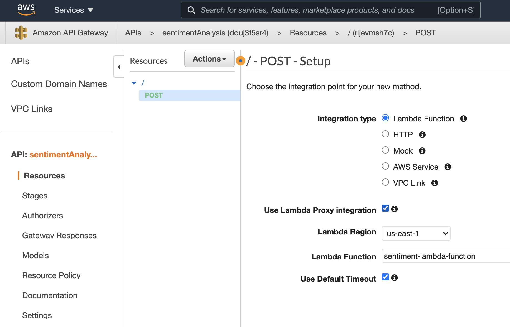

1. Introduction to deployment
2. Building a model using Sagemaker
3. (*) Deploying and using a model 
   - 3.1 Building and Deploying the Model.
         IMDB Sentiment Analysis - XGBoost - Web App
         https://youtu.be/JCiQhhXbeuc
   - 3.2 Building a lambda function. Ref: https://youtu.be/jOXETK4AerU 
   
   Notebook: [IMDB Sentiment Analysis - XGBoost - Web App](https://github.com/manas-mukherjee/machine-learning-nanodegree/blob/master/nanodegree-2021/3-ML-IN-PRODUCTION/sagemaker-deployment-master/Tutorials/IMDB%20Sentiment%20Analysis%20-%20XGBoost%20-%20Web%20App.ipynb)

```json 
{
  "body": "This is an excellent movie. I will encourage everyone to see it",
  "resource": "/{proxy+}",
  "path": "/path/to/resource",
  "httpMethod": "POST",
  "isBase64Encoded": true,
  "queryStringParameters": {
    "foo": "bar"
  },
  "multiValueQueryStringParameters": {
    "foo": [
      "bar"
    ]
  },
  "pathParameters": {
    "proxy": "/path/to/resource"
  },
  "stageVariables": {
    "baz": "qux"
  },
  "headers": {
    "Accept": "text/html,application/xhtml+xml,application/xml;q=0.9,image/webp,*/*;q=0.8",
    "Accept-Encoding": "gzip, deflate, sdch",
    "Accept-Language": "en-US,en;q=0.8",
    "Cache-Control": "max-age=0",
    "CloudFront-Forwarded-Proto": "https",
    "CloudFront-Is-Desktop-Viewer": "true",
    "CloudFront-Is-Mobile-Viewer": "false",
    "CloudFront-Is-SmartTV-Viewer": "false",
    "CloudFront-Is-Tablet-Viewer": "false",
    "CloudFront-Viewer-Country": "US",
    "Host": "1234567890.execute-api.us-east-1.amazonaws.com",
    "Upgrade-Insecure-Requests": "1",
    "User-Agent": "Custom User Agent String",
    "Via": "1.1 08f323deadbeefa7af34d5feb414ce27.cloudfront.net (CloudFront)",
    "X-Amz-Cf-Id": "cDehVQoZnx43VYQb9j2-nvCh-9z396Uhbp027Y2JvkCPNLmGJHqlaA==",
    "X-Forwarded-For": "127.0.0.1, 127.0.0.2",
    "X-Forwarded-Port": "443",
    "X-Forwarded-Proto": "https"
  },
  "multiValueHeaders": {
    "Accept": [
      "text/html,application/xhtml+xml,application/xml;q=0.9,image/webp,*/*;q=0.8"
    ],
    "Accept-Encoding": [
      "gzip, deflate, sdch"
    ],
    "Accept-Language": [
      "en-US,en;q=0.8"
    ],
    "Cache-Control": [
      "max-age=0"
    ],
    "CloudFront-Forwarded-Proto": [
      "https"
    ],
    "CloudFront-Is-Desktop-Viewer": [
      "true"
    ],
    "CloudFront-Is-Mobile-Viewer": [
      "false"
    ],
    "CloudFront-Is-SmartTV-Viewer": [
      "false"
    ],
    "CloudFront-Is-Tablet-Viewer": [
      "false"
    ],
    "CloudFront-Viewer-Country": [
      "US"
    ],
    "Host": [
      "0123456789.execute-api.us-east-1.amazonaws.com"
    ],
    "Upgrade-Insecure-Requests": [
      "1"
    ],
    "User-Agent": [
      "Custom User Agent String"
    ],
    "Via": [
      "1.1 08f323deadbeefa7af34d5feb414ce27.cloudfront.net (CloudFront)"
    ],
    "X-Amz-Cf-Id": [
      "cDehVQoZnx43VYQb9j2-nvCh-9z396Uhbp027Y2JvkCPNLmGJHqlaA=="
    ],
    "X-Forwarded-For": [
      "127.0.0.1, 127.0.0.2"
    ],
    "X-Forwarded-Port": [
      "443"
    ],
    "X-Forwarded-Proto": [
      "https"
    ]
  },
  "requestContext": {
    "accountId": "123456789012",
    "resourceId": "123456",
    "stage": "prod",
    "requestId": "c6af9ac6-7b61-11e6-9a41-93e8deadbeef",
    "requestTime": "09/Apr/2015:12:34:56 +0000",
    "requestTimeEpoch": 1428582896000,
    "identity": {
      "cognitoIdentityPoolId": null,
      "accountId": null,
      "cognitoIdentityId": null,
      "caller": null,
      "accessKey": null,
      "sourceIp": "127.0.0.1",
      "cognitoAuthenticationType": null,
      "cognitoAuthenticationProvider": null,
      "userArn": null,
      "userAgent": "Custom User Agent String",
      "user": null
    },
    "path": "/prod/path/to/resource",
    "resourcePath": "/{proxy+}",
    "httpMethod": "POST",
    "apiId": "1234567890",
    "protocol": "HTTP/1.1"
  }
}
``` 

Response:


Test Event Name
testevent

Response
```json
{
  "statusCode": 200,
  "headers": {
    "Content-Type": "text/plain",
    "Access-Control-Allow-Origin": "*"
  },
  "body": "0"
}
```
Function Logs
START RequestId: 78f85e11-f7a2-4736-a0a1-acb303a702ae Version: $LATEST
END RequestId: 78f85e11-f7a2-4736-a0a1-acb303a702ae
REPORT RequestId: 78f85e11-f7a2-4736-a0a1-acb303a702ae	Duration: 769.18 ms	Billed Duration: 770 ms	Memory Size: 128 MB	Max Memory Used: 74 MB

Request ID
78f85e11-f7a2-4736-a0a1-acb303a702ae

   - 3.3. Building an API using API Gateway. Ref: https://youtu.be/AzBQ-aDQSG4
     API Gateway
     
     

4. Hypterparamter Tuning 
5. Updating a model 
6. Project-Deploy a sentiment analyzer model 


